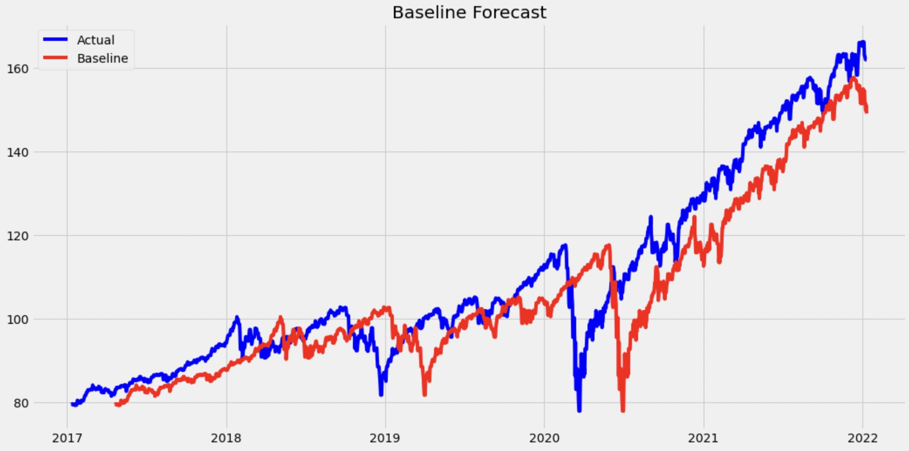
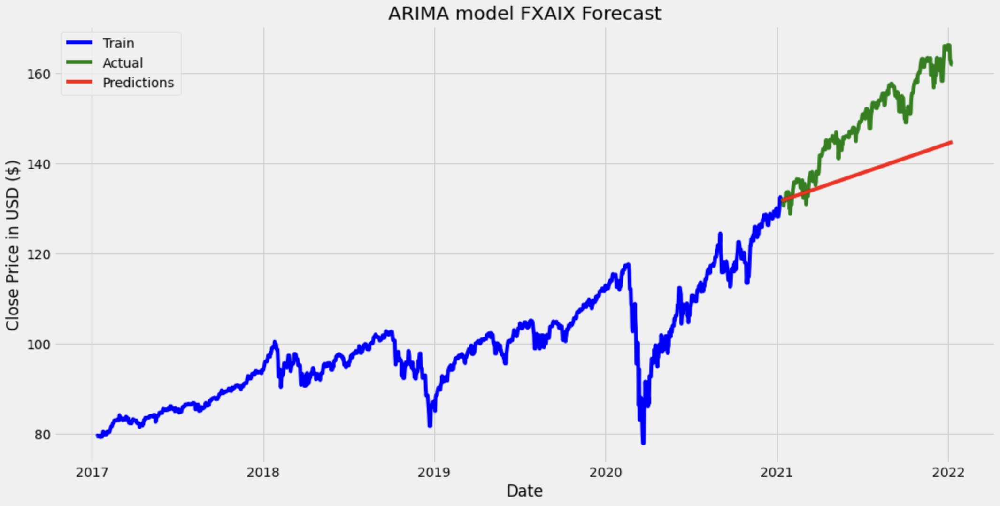
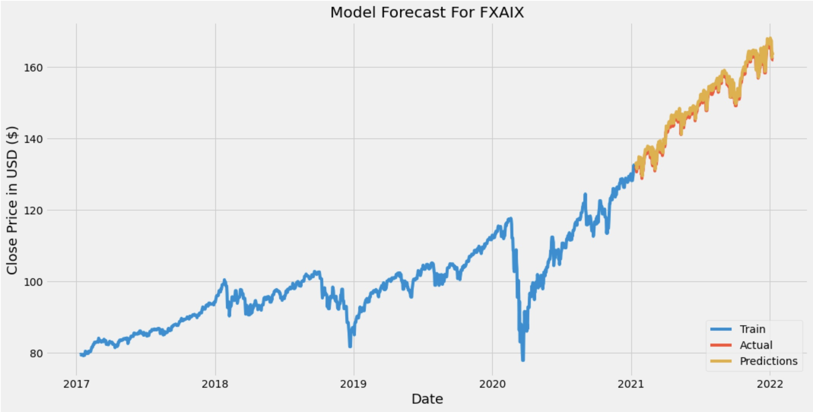
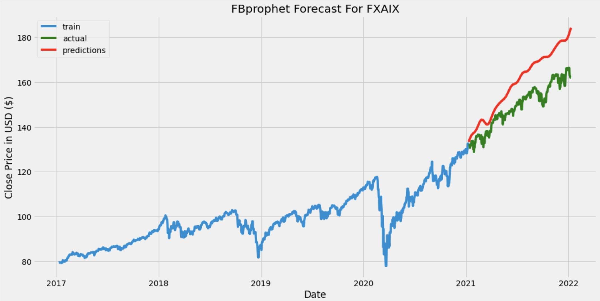
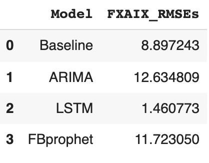

# Modeling 

This folder will contain all of the modeling processes and results for each of the 13 funds. Each of the funds underwent the same steps towards find the best predictive model to predict the closing price of that fund. 

We begin by creating a naive baseline which was a shifted version of the original.

Then we created our three different models and tested them by first creating a train-test split on the data. We use a 80% training set and 20% test set. Next, we fit each model using the training set and make predictions of the closing prices for the dates contained in the test set. Using these predictions and the true closing prices, the test data, we calculate the RMSE for the model. 

Our first model was an ARIMA model:

Then we moved on to an LSTM model:

and lastly a FBprophet:

After testing each model, we determine which model performed the best by comparing the RMSEs of each model:

Lastly, we choose the most optimal model, the one with the lowest RMSE, to make predictions of the closing prices for the rest of the year and calculate the projected ROI. I saved the results for all the funds into the two CSV files found in this folder. These files will be used in the Evaluation.ipynb notebook to draw our final recommendations.  