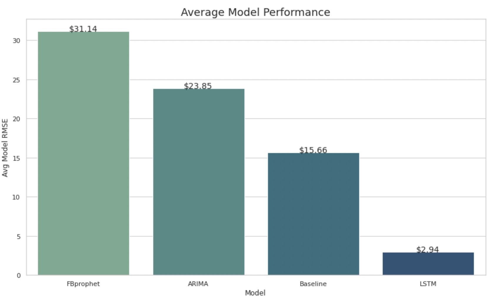
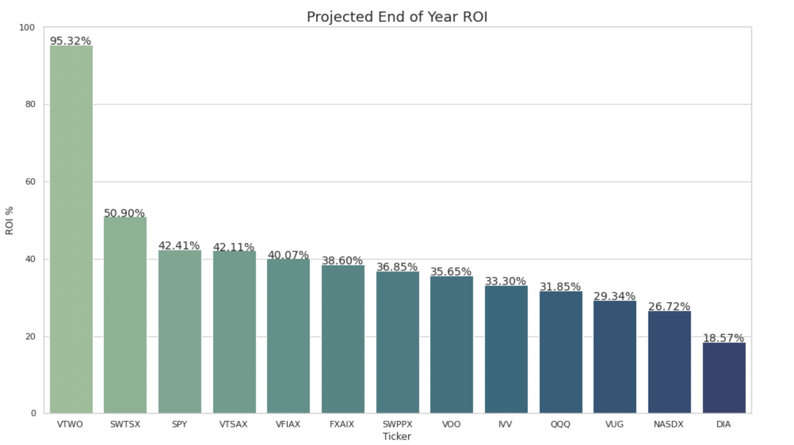

# Index Funds And ETFs Price Forecast


## Overview
Index Funds and ETFs are among the most common investment products being purchased today. Rather than purchasing shares from individual companies one at a time, these funds allow an investor to hold a "basket" of stocks from various companies with a single purchase. This way of investing offers the benefits of having lower cost, lower risk through diversification, and higher returns. In this project, we will use Time Series Analysis and Modeling to forecast closing prices of popular index funds and ETFs to make recommendations on which funds to invest in. With there being many index funds and ETFs out in the market, we will focus on some of the more popular ones out there, according to [bankrate](https://www.bankrate.com/investing/best-index-funds/).

Order of Notebooks:

1. EDA
2. Modeling
3. Evaluation

Running the modeling notebooks on [google colab](https://colab.research.google.com/?utm_source=scs-index) is recommended as that is the environment used to construct the notebooks. I also leave the proper adjustments to be made if you choose to follow along on jupyter notebook.

## Business Objective
For this project, we will operate as a financial advising firm. The main goal is to be able to offer our clients, investors, an easy way to decide on which funds to invest in. In order to do this, we will need to create a predictive model that will be able to make accurate close price predictions for the next year. To be able to distinguish which funds are the "best", we will predict the closing prices for each fund and calculate their ROIs for the next 365 days. Based on the ROIs we will be able to make our recommendations to our clients.

## Data
The data used was collected through the [tiingo API](https://api.tiingo.com/documentation/general/overview). In order to start using the API, you must create a free account if you do not have one already. Upon signing up, your API access token will be available in the general section of the API documentation. 

The limitation to the free account, is that you will only be allowed historical stock data from the last 5 years up until when the request is made. For access to more historical data, you will need to sign up for a premium account.

The tiingo API will return data regarding the date, open, close, high, low and volume for the specified index fund ticker. For this project, I collected the 5 year historical data from 13 different index funds and ETFs. The funds in question are [NASDX](https://www.tiingo.com/nasdx/overview), [IVV](https://www.tiingo.com/ivv/overview), [VFIAX](https://www.tiingo.com/vfiax/overview), [VTSAX](https://www.tiingo.com/vtsax/overview), [QQQ](https://www.tiingo.com/qqq/overview), [SWPPX](https://www.tiingo.com/swppx/overview), [SWTSX](https://www.tiingo.com/swtsx/overview), [FXAIX](https://www.tiingo.com/swtsx/overview), [DIA](https://www.tiingo.com/dia/overview), [VUG](https://www.tiingo.com/vug/overview), [SPY](https://www.tiingo.com/spy/overview), [VOO](https://www.tiingo.com/voo/overview), and [VTWO](https://www.tiingo.com/vtwo/overview). 

The data folder in this repository provides the notebook of the data collection from the API and the combining of information of all funds into one DataFrame, which I then save into a CSV file.

## Methodology
The approaches I took towards building a predictive model were to build three types of models. They are an ARIMA model, FBprophet model, and a LSTM (Long Short Term Memory) model which is a special type of RNN (Recurrent Neural Network). The goal was to make a reliable predicive model, thus the best performing model will be the one with the lowest RMSE. After finding the best performing model, I used the model to come up with the closing prices for the next 365 days and calculate the ROIs for that time frame. Based on the ROIs, I will be able to give my recommendations on which funds are worth investing in.

## Results 
After modeling each fund's closing price using each model, I calculated the RMSEs for each model to evaluate their performance. Since we have 13 different funds with each fund being modeled using the baseline, ARIMA, LSTM, and FBprophet, I calculated the average rmse that each model scored among all funds. This was done to get an general overview of how each model performed when predicting the closing prices. Here I provide the bar chart of these results:



The LSTM model was the best model for making accurate predictions as the average RMSE was the lowest among the other two models. After confirming the best model, I started to make the next 365 day close price predictions for each fund. Using those predictions, I calculated each funds projected one year ROIs.




## Conclusion
The projected ROIs suggest that the funds with tickers VTWO, SWTSX, and SPY are the recommended fund to invest, however the projected ROIs appear to be suspiciously large. Rather than being quick to recommend these funds to investors, I would like to take precaution and investigate further on the matter. The next steps to continue this investigation would be to obtain more data that extends past the 5 year historical data gathered from tiingo, consult with others with domain knowledge, and try tuning the LSTM model.


## Repository Structure
```
├── README.md                           <- Provides An Overview Of The Repository
├── data                                <- Contains The Notebook Used For Data Collection and The CSV File
├── EDA.ipynb                           <- Inital EDA Of The Data
├── Modeling                            <- Folder Containing The Modeling Notebooks For Each Fund
└── Evaluation.ipynb                    <- Final Evaluation and Recommendations 
```